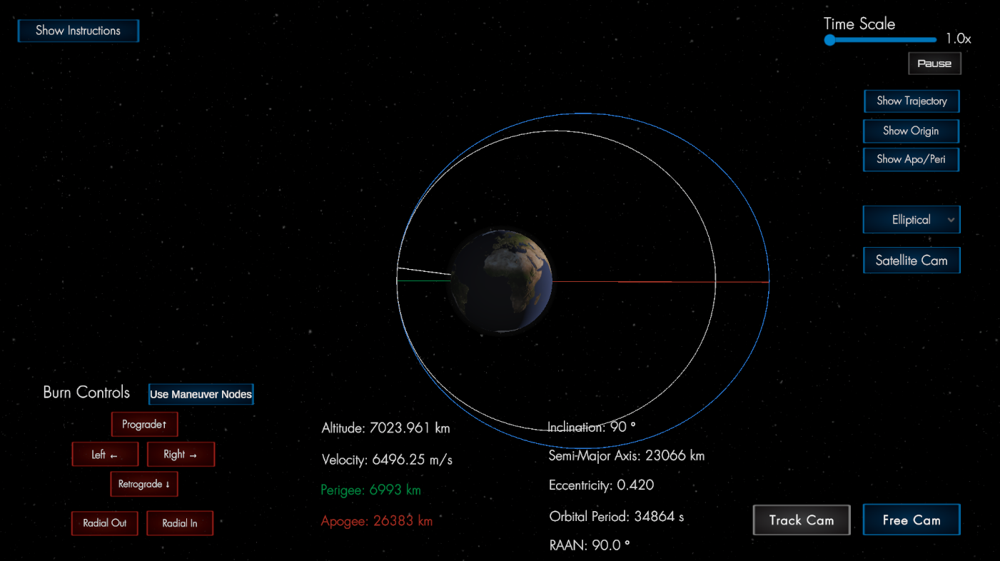
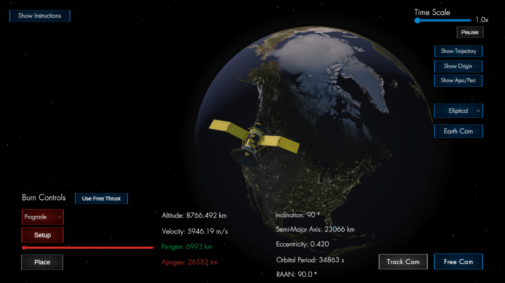
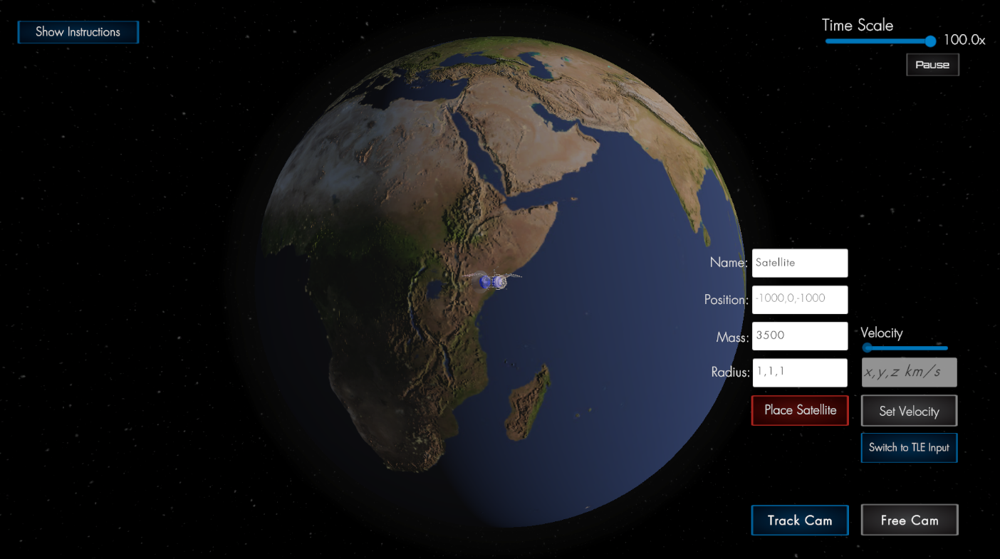

# Orbital Control Simulator

Drop in real satellite data, apply thrust, and watch orbital paths shift in real time. This isn’t just a visualization tool. It’s a physics-based simulator that uses a native integrator and GPU-predicted trajectories to model orbital mechanics with precision. Built in Unity and powered by a custom double-precision C++ backend, it handles maneuver nodes, atmospheric drag, and orbital propagation entirely outside Unity’s physics system.

[🎥 Watch the Demo Video on Youtube](https://www.youtube.com/watch?v=aisBrqQ_A4o&feature=youtu.be)




---

## Why I Built This

I got interested in orbital mechanics after watching a few rocket launches and started digging into what actually happens after liftoff. I didn’t have a background in orbital physics or game development, so I used this project as a way to learn both. I wanted something that combined low-level systems, real-time performance, physics modeling, and 3D visualization. This led to me making a simulator that models real orbital behavior using a custom C++ physics engine, double-precision integration, and Unity-based rendering. The goal wasn’t just to visualize orbits. It was to understand and simulate them as accurately as possible.

---
## Capabilities & Features  
*All functionality is live in runtime.*
1. Live computation of orbital parameters including apogee, perigee, velocity, altitude, period, inclination, eccentricity, semi-major axis, and RAAN
2. Real-time orbital decay via atmospheric drag modeling  
3. Instant thrust maneuvers in multiple directions (prograde, radial, normal, etc.)  
4. Toggle between Free Thrust and early Maneuver Node system  
5. In Node mode:  
   - Select burn direction (prograde, retrograde, radial, normal, etc.)  
   - Setup a maneuver node and adjust its orbital position  
   - Auto-execute burns when the satellite reaches the node  
   - See updated orbital paths post-burn with color-coded trajectories (gray = old, blue = new)  
6. GPU-predicted trajectories rendered using async RK4 integration (separate from live sim)  
7. Runtime placement of satellites with mass, radius, velocity, and direction  
8. Add satellites at runtime via TLE input  
9. Time scaling from 1x to 100x for long-term simulations  
10. Dual camera modes (free roam and tracking)

---

## Purpose

I built this to explore and implement orbital mechanics concepts in a real-time environment. It served as a way to:

- Deepen my understanding of spacecraft dynamics and numerical integration
- Implement numerical integration methods for stable, high-accuracy propagation
- Handle real-world perturbation forces like drag
- Work on interoperability between Unity and native C++ (via DLLs)
- Optimize rendering in a live physics environment

---

## Architecture Overview

- **Physics Core (C++ DLL):** Dormand–Prince 5(4) integrator, double-precision, real-time execution
- **Unity Frontend:** UI, scene management, camera controls, and GPU-based line rendering
- **Thrust Model:** Instantaneous impulse-based velocity change (scaled by body mass)
- **Atmospheric Drag:** Empirical model using interpolated density tables and cross-sectional area
- **Interop Layer:** Unity communicates with the C++ backend via `DllImport`

---
## How to Run

### Requirements
- Unity 2020.3 or later (tested on LTS versions)
- Windows 64-bit (required for native C++ DLL support)

### Run from the Unity Editor

1. Clone the repo:
   ```bash
   git clone https://github.com/Brprb08/space-orbit-simulation.git
   ```
2. Open the project in Unity Hub  
3. Load the scene: `Assets/Scenes/OrbitSimulation.unity`  
4. Press `Play` in the Unity Editor

The native physics backend is provided as a precompiled 64-bit DLL in `Assets/Plugins/x86_64/`.  
You do not need to compile the DLL yourself.

The following runtime dependencies are also included to support the C++ plugin:
- `libgcc_s_seh-1.dll`
- `libstdc++-6.dll`
- `libwinpthread-1.dll`

These are required on systems that do not have the GCC runtime installed.

### Build and Run (Standalone Executable)

To build and run the simulator as a standalone Windows application:

1. In Unity, open the menu:
   - File → Build Settings (or Build Profiles, depending on your version)  

2. Select **Windows** as the target platform
3. Ensure the following settings:
   - **Architecture**: `Intel 64-bit`
   - **Build and Run on**: `Local Machine`
   - Make sure `Scenes/OrbitSimulation` is checked in the Scene List

4. Click **Build**, then select a folder to save the build output.
5. After the build completes, open the output folder and run the `SpaceOrbit.exe` file

All required DLLs (including the native physics plugin and its runtime dependencies) will be included automatically, as long as they are in `Assets/Plugins/x86_64/`.

---

## Unit Testing

- Includes Editor Mode unit tests for utility logic
- All tests written in C# using Unity Test Framework
- 34/34 tests passing as of latest commit (TLE parsing, camera math, edge cases)
- Utility classes refactored for testability (static methods, no MonoBehaviours)

---

[See Technical README →](./TECHNICAL_README.md)

---

*This project was designed as a technical demonstration of my abilities in simulation engineering, physics programming, and real-time system development.*

[⬆ Back to Top](#orbital-control-simulator)
